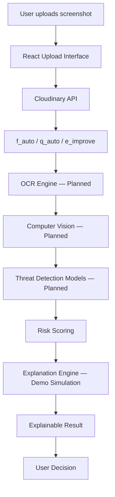

# Sense Check AI

> **Think Before You Trust.**

An AI-powered scam and threat analysis frontend. Upload suspicious screenshots — messages, payment pages, QR codes, phishing emails, KYC notices — and receive an explainable risk assessment with actionable recommendations.

---

## Product Overview

Sense Check AI is a cybersecurity decision-support tool. It analyses visual digital content submitted by users and:

1. Ingests and optimises the image via **Cloudinary**
2. Extracts text and visual signals (OCR + Computer Vision)
3. Evaluates threat indicators against known scam patterns
4. Produces an **explainable** risk score with individual signal breakdowns
5. Recommends concrete actions for the user

The product is designed as a **human-in-the-loop** tool — AI provides analysis, humans make decisions.

---

## Features

- **Single-viewport landing page** — preserved from original design
- **Upload interface** — drag-and-drop, file picker, progress bar, preview
- **5-state analysis flow** — idle → uploading → processing → result → error
- **Explainable AI results** — individual threat signals with severity, explanation, and evidence
- **Risk scoring** — 0–100 scale with Low / Suspicious / High bands
- **Recommended actions** — practical, non-alarmist guidance
- **Scroll storytelling** — `/scroll-writing` explains the architecture visually
- **Demo mode** — fully functional without a backend
- **Cloudinary integration** — ready to connect with real credentials
- **Responsive** — mobile, tablet, desktop, large desktop, ultrawide

---

## Architecture



---

## Cloudinary Integration

Cloudinary is the media ingestion, optimisation, and management layer.

### Configuration

Copy `.env.example` to `.env.local` and fill in your values:

```env
VITE_CLOUDINARY_CLOUD_NAME=your_cloud_name
VITE_CLOUDINARY_UPLOAD_PRESET=your_unsigned_preset
```

### How to create an unsigned upload preset

1. Go to [Cloudinary Console](https://cloudinary.com/console) → Settings → Upload
2. Click **Add upload preset**
3. Set **Signing mode** to **Unsigned**
4. Copy the preset name into `VITE_CLOUDINARY_UPLOAD_PRESET`

### Image optimisation transformations

| Transformation | Purpose |
|---|---|
| `f_auto` | Automatic format (WebP / AVIF) |
| `q_auto` | Automatic quality compression |
| `e_improve` | Visual enhancement for better OCR |
| `e_enhance` | Additional visual clarity |

### Asset classification pipeline (planned)

Uploaded assets are tagged by detected category:

```
QR_CODE | WHATSAPP | SMS | EMAIL | PAYMENT_GATEWAY | KYC_DOCUMENT | SOCIAL_MEDIA | TRANSACTION_SCREENSHOT
```

Different categories can route into specialised analysis pipelines.

---

## Frontend Workflow

```
/                    Landing page — brand introduction, CTA
/analyze             Upload → Processing → Result flow
/scroll-writing      Scroll-driven architecture storytelling
```

---

## Project Structure

```
src/
├── components/
│   ├── LogoMark.jsx         SVG logo mark
│   └── Navbar.jsx           Header with nav + burger
├── sections/                (reserved for landing page sections)
├── pages/
│   ├── LandingPage.jsx      / route — exact design from index.html
│   ├── AnalyzePage.jsx      /analyze — full upload/analysis flow
│   └── ScrollWritingPage.jsx /scroll-writing — storytelling
├── hooks/
│   └── useAppearAnimation.js  Animation fallback (mirrors original IIFE)
├── services/
│   └── cloudinary.js        All Cloudinary logic (isolated)
├── data/
│   ├── navLinks.js          Navigation link data
│   └── demoAnalysis.js      Mock analysis result + risk utilities
├── index.css                All CSS (verbatim port of original design)
├── App.jsx                  React Router setup
└── main.jsx                 Vite entry
```

---

## Environment Variables

| Variable | Required | Description |
|---|---|---|
| `VITE_CLOUDINARY_CLOUD_NAME` | For real uploads | Your Cloudinary cloud name |
| `VITE_CLOUDINARY_UPLOAD_PRESET` | For real uploads | Unsigned upload preset name |

Without these variables, the app runs in **demo mode** — all uploads are simulated locally.

---

## Local Development

```bash
# Install dependencies
npm install

# Start dev server
npm run dev

# Build for production
npm run build
```

---

## Demo Mode

When `VITE_CLOUDINARY_CLOUD_NAME` is not set, the app automatically enters demo mode:

- Uploads are simulated with a local `URL.createObjectURL`
- Processing stages animate realistically
- Result uses `demoAnalysis.js` mock data
- A **DEMO ANALYSIS** banner is displayed to the user

Demo mode is clearly distinguished from real production inference.

---

## Future Backend Architecture

| Component | Status | Notes |
|---|---|---|
| React Frontend | ✅ Live | This repository |
| Cloudinary Ingestion | ✅ Ready | Needs credentials |
| OCR Engine | 🔲 Planned | Tesseract / Google Vision / AWS Textract |
| Computer Vision | 🔲 Planned | Image layout, QR code, logo detection |
| Threat Detection Models | 🔲 Planned | Custom fine-tuned or rules-based |
| Explanation Engine | 🔲 Planned | Currently demo simulation |
| Real-time Threat Intel | 🔲 Planned | URL reputation, known scam patterns |

---

## Security Considerations

- **No API secrets in frontend code** — Cloudinary API Secret is never exposed
- Only unsigned upload preset (safe for frontend) is used
- Uploaded images are not permanently retained in demo mode
- All environment variables use the `VITE_` prefix (Vite exposes these to the browser — only put public config here)
- A backend API layer should handle all sensitive model inference and secret management in production
